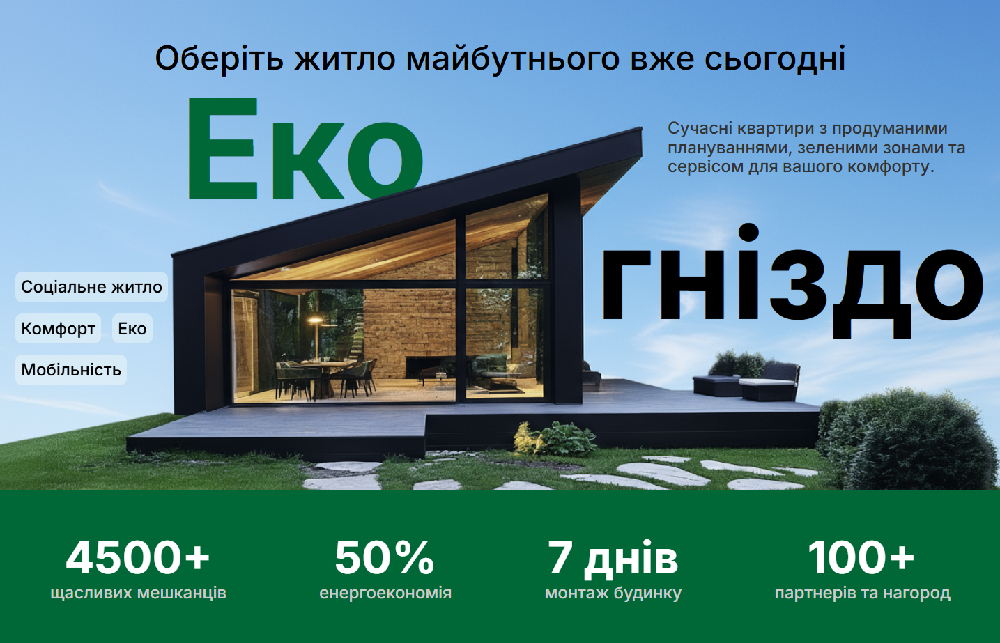

# 🏠 EcoNest - Модульні будинки для переселенців

## 📋 Опис проєкту

EcoNest — це веб-платформа, створена в рамках хакатону, що презентує модульні будинки для переселенців, які втратили
житло через війну в Україні.  
Мета — поєднати дизайн, сучасний фронтенд-стек і реальні сценарії користувачів.



---

## 🎯 Основна мета

Створити сучасний, функціональний веб-ресурс, який:

- Інформує про доступні моделі модульних будинків
- Надає можливість підтримати ініціативу
- Забезпечує зручний зворотний зв'язок з потенційними клієнтами
- Демонструє детальну інформацію про кожен тип житла

---

## 🛠️ Технічний стек

**Frontend**

- _React [v18.x]_ - основний фреймворк для побудови UI
- _Next.js [v14.x]_ - для SSR, маршрутизації та оптимізації
- _TypeScript_ - для типізації коду
- _Tailwind CSS_ - для стилізації та responsive design
- _Framer Motion_ - для анімацій та плавних переходів
- _React Hook Form_ - для роботи з формами
- _React Query/TanStack Query_ - для управління серверним станом

**UI/UX та Дизайн**

- _Figma_ - для створення дизайн-макетів
- _Lucide React_ - іконки
- [Додаткові бібліотеки для UI компонентів]??

**Аналітика та моніторинг**

- _Google Analytics 4_ - для відстеження користувачів
- _Google Tag Manager_ - для управління тегами
- [Hotjar/Microsoft Clarity] - для heatmaps та user behavior ??

**Деплой та DevOps**

- _Vercel_ - для деплою та хостингу
- _Git_ - контроль версій ??
- _GitHub_ - репозиторій коду

**Інші інструменти**

- _ESLint + Prettier_ - для якості коду Husky - git hooks для pre-commit перевірок

---

## 🏗️ Архітектура проєкту

```econest
📁 econest/
├── 📁 public/                  -- Статичні файли
│   ├── 📁 images/              -- Зображення будинків, інтер'єрів
│   ├── 📄 icons/                  -- Іконки та логотипи
│   └── 📄 favicon.ico
├── 📁 src/
│   ├── 📁 components/         -- React компоненти
│   │   ├── 📁 common/             -- Загальні компоненти
│   │   │   ├── 📄 Header/
│   │   │   ├── 📄 Footer/
│   │   │   ├── 📄 Layout/
│   │   │   └── 📄 Navigation/
│   │   ├── 📁 forms/              -- Форми
│   │   │   ├── 📄 ContactForm/
│   │   │   ├── 📄 DonationForm/
│   │   │   └── 📄 FeedbackForm/
│   │   ├── 📁 ui/                 -- UI компоненти
│   │   │   ├── 📄 Button/
│   │   │   ├── 📄 Card/
│   │   │   ├── 📄 Modal/
│   │   │   └── 📄 Input/
│   │   └── 📁 sections/           -- Секції сторінок
│   │       ├── 📄 Hero/
│   │       ├── 📄 HouseModels/
│   │       ├── 📄 Advantages/
│   │       └── 📄 FAQ/
│   ├── 📁 pages/                  -- Next.js сторінки
│   │   ├── 📄 index.tsx           -- Головна сторінка
│   │   ├── 📄 models/             -- Моделі будинків
│   │   ├── 📄 house/
│   │   │   └── [id].tsx        -- Детальна інформація про будинок
│   │   ├── 📄 contacts.tsx        -- Контакти
│   │   └── 📄 faq.tsx            -- Поширені запитання
│   ├── 📁 styles/                 -- Стилі
│   │   ├── 📄 globals.css
│   │   └── 📁 components/
│   ├── utils/                  -- Допоміжні функції
│   ├── hooks/                  -- Custom hooks
│   ├── types/                  -- TypeScript типи
│   ├── data/                   -- Статичні дані
│   │   ├── 📄 houses.json         -- Інформація про будинки
│   │   └── 📄 faq.json           -- FAQ дані
│   └── lib/                    -- Конфігурації (analytics, etc.)
├── 📁 docs/                       -- Документація
│   ├── 📄 DESIGN.md              -- Дизайн-рішення
│   ├── 📄 ANALYTICS.md           -- Аналітика та метрики
│   └── 📄 DEPLOYMENT.md          -- Інструкції деплою
├── .github/                    -- GitHub workflows
├── tests/                      -- Тести (якщо є)??
└── 📁 package.json
```

---

## ⚡ Швидкий старт

### Вимоги

- Node.js >= 18.x
- npm або yarn

### Встановлення

```# Клонування репозиторію
git clone [URL репозиторію]
cd econest

# Встановлення залежностей
npm install
# або
yarn install

# Запуск в режимі розробки
npm run dev
# або
yarn dev
```

Відкрийте http://localhost:3000 у браузері.

### Доступні команди

```
bashnpm run dev          # Запуск в режимі розробки
npm run build        # Збірка для продакшену
npm run start        # Запуск продакшен збірки
npm run lint         # Перевірка коду ESLint
npm run lint:fix     # Автоматичне виправлення ESLint
npm run type-check   # Перевірка TypeScript типів
```

---

## 📱 Функціональність

### Основні можливості

- **Адаптивний дизайн** - коректне відображення на desktop, tablet, mobile
- **xДетальна інформація про моделі** - галерея, плани, характеристики
- **Форми зворотного зв'язку** - з валідацією та обробкою помилок
- **Інтеграція з донатами** - реферальні посилання на довірені фонди
- **SEO оптимізація** - meta теги, structured data
- **Плавні анімації** - покращення user experience
- **FAQ секція** - відповіді на поширені запитання

### Особливі рішення

- **Компонентний підхід** - переважно функціональні компоненти з хуками
- **Динамічний рендеринг** - статична генерація для швидкості завантаження
- **Форми з валідацією** - React Hook Form + зручні повідомлення про помилки
- **Оптимізація зображень** - Next.js Image компонент для швидкості
- **Доступність (a11y)** - ARIA атрибути, keyboard navigation

## 📊 Аналітика та метрики

### Відстежувані метрики

- Джерела трафіку (social media, direct search, інші НГО, новинні статті)
- Найбільш відвідувані сторінки
- Час проведений на сторінці
- Кількість унікальних користувачів
- Конверсія форм зворотного зв'язку
- Відсоток незакінчених форм (abandonment rate)
- Кліки на кнопки донатів
- Соціальні шари (sharing)

### Практичне застосування даних

- Оптимізація контенту на основі популярних сторінок
- Покращення UX форм на основі abandonment rate
- A/B тестування CTA кнопок
- Таргетинг рекламних кампаній на основі джерел трафіку

Детальніше в [docs/ANALYTICS.md](docs/ANALYTICS.md)

---

## 🎨 Дизайн

Дизайн створено в Figma з адаптивними версіями для:

- Desktop (1440px+)
- Tablet (768px - 1439px)
- Mobile (320px - 767px)

`Figma` проєкт: [Посилання на Figma]

### Дизайн-система

- Кольорова палітра: [Primary, Secondary, Accent colors]
- Типографіка: [Font families, sizes, weights]
- Компоненти: Кнопки, форми, картки, модальні вікна
- Іконки: `Lucide React set`

Детальніше в [docs/DESIGN_SYSTEM.md](docs/DESIGN_SYSTEM.md)

---

## 🚀 Деплой

Проєкт деплоїться на Vercel з автоматичним деплоєм при push в main гілку.

**Production URL**: https://eco-house-zeta.vercel.app/

**Змінні середовища**

```
envNEXT_PUBLIC_GA_MEASUREMENT_ID=G-XXXXXXXXXX
NEXT_PUBLIC_GTM_ID=GTM-XXXXXXX
# Додаткові змінні для форм, API тощо
```

Детальніше в [docs/DEPLOYMENT.md](docs/DEPLOYMENT.md)

---

## 🧪 Виклики та рішення

### Технічні виклики

**ПРИКЛАДИ**:

- Оптимізація зображень великої кількості будинків Рішення: Next.js Image з lazy loading та WebP формат

- Складні форми з багатьма полями Рішення: React Hook Form + Zod для валідації

- SEO для динамічних сторінок будинків Рішення: Статична генерація з getStaticProps

- Плавні анімації без втрати продуктивності Рішення: Framer Motion з оптимізованими transitions

### UX виклики

- Інформативність без перевантаження Рішення: Поетапне розкриття інформації, progressive disclosure

- Мобільна навігація для багатьох сторінок Рішення: Hamburger menu з логічним групуванням

---

## 👥 Команда та ролі

- Сердюк Роман - Frontend Developer
- Бойко Інна - Senior Frontend Developer / Tech Lead
- Княжик Роман - Frontend Developer / JavaScript
- Герич Олена - Frontend Developer
- Юлія Крест'янко - QA Tester / Data Analyst
- Шпильова Яна - UI/UX Designer
- Кожемяка Світлана - UI/UX Designer
- Ірина Цимбалюк - Data Analyst / Documentation
- Олександр Сальніков - Data Analyst / Video Production

## 🔧 Розробка та внесок

**Методологія команди** Команда працювала за розподіленим підходом, де кожен учасник виконував свою частину завдання:

- **Frontend розробники** створювали компоненти та сторінки локально
- **UI/UX дизайнери** розробляли макети в Figma
- **Аналітики** підготували документацію та запропонували метрики для збору аналітики
- **Інтеграція та збірка** - централізовано об'єднано в єдиний репозиторій

## Стандарти коду

- TypeScript для типізації
- Компонентна архітектура React
- Tailwind CSS для консистентної стилізації
- Структуровані папки та зрозумілі назви файлів

## 📄 Ліцензія

[MIT License / Відкрита для некомерційного використання]

---

**EcoNest Team** © 2025 - Разом відбудуємо Україну! 🇺🇦
